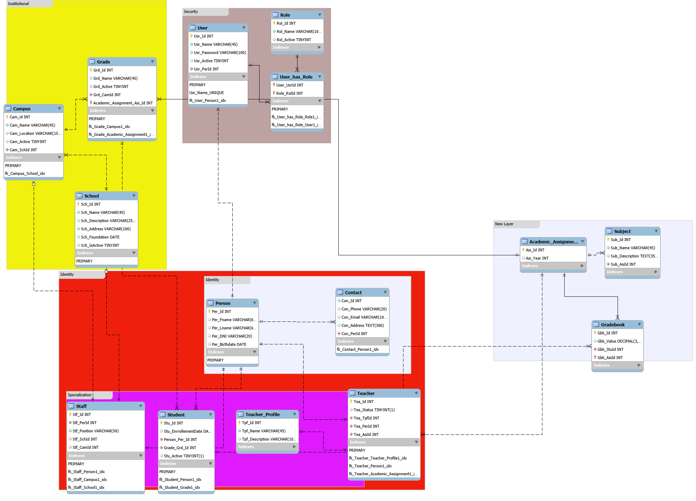
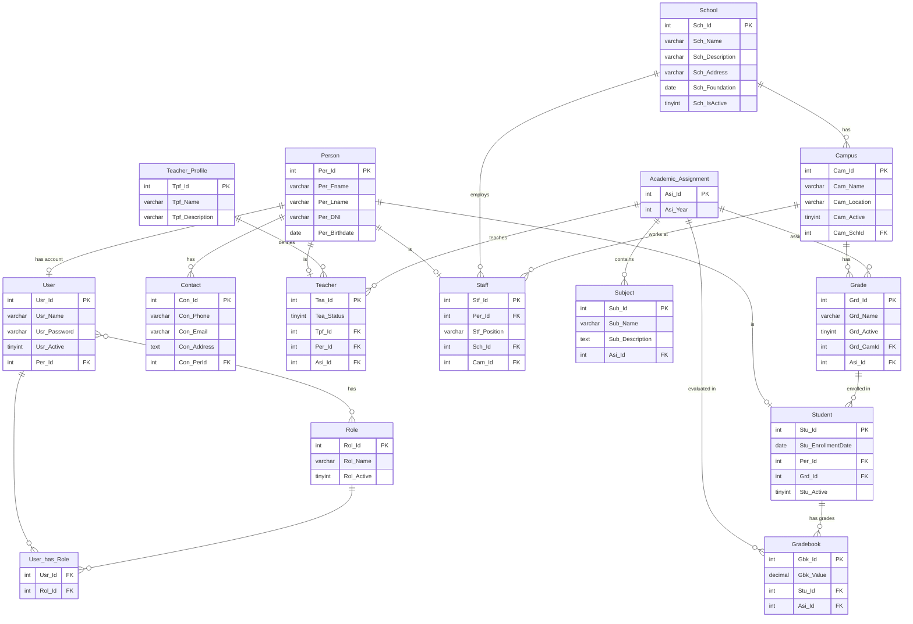

# 🏫 Rural School Management API

> REST API for managing rural schools, campuses, grades, persons, contacts, students, teachers and staff.
> Built with Java 21, Spring Boot and Docker — ready to run in minutes.

---

## 🚀 Tech Stack

| Technology | Version |
|---|---|
| Java | 21 |
| Spring Boot | 3.5.11 |
| Gradle | 8.x |
| MapStruct | 1.6.3 |
| MySQL | latest |
| Docker | latest |
| Springdoc OpenAPI (Swagger) | 2.7.0 |

---

## 🏗️ Architecture

The project follows a **layered architecture** with clear domain separation:

**domain/**
- `dto/identity/contact` — ContactDto, UpdateContactDto
- `dto/identity/person` — PersonDto, UpdatePersonDto
- `dto/identity/specialization/student` — StudentDto, UpdateStudentDto
- `dto/identity/specialization/teacher` — TeacherDto, UpdateTeacherDto
- `dto/identity/specialization/teacherProfile` — TeacherProfileDto, UpdateTeacherProfileDto
- `dto/identity/specialization/staff` — StaffDto, UpdateStaffDto
- `dto/institutional/campus` — CampusDto, UpdateCampusDto
- `dto/institutional/grade` — GradeDto, UpdateGradeDto
- `dto/institutional/school` — SchoolDto, UpdateSchoolDto
- `repository/Identity` — ContactRepository, PersonRepository, StudentRepository, TeacherRepository, TeacherProfileRepository, StaffRepository
- `repository/Institutional` — CampusRepository, GradeRepository, SchoolRepository
- `service/Identity` — ContactService, PersonService, StudentService, TeacherService, TeacherProfileService, StaffService
- `service/Institutional` — CampusService, GradeService, SchoolService

**persistence/**
- `entity/Identity` — ContactEntity, PersonEntity, StudentEntity, TeacherEntity, TeacherProfileEntity, StaffEntity
- `entity/Institutional` — CampusEntity, GradeEntity, SchoolEntity
- `mapper/Identity` — ContactMapper, PersonMapper, StudentMapper, TeacherMapper, TeacherProfileMapper, StaffMapper
- `mapper/Institutional` — CampusMapper, GradeMapper, SchoolMapper
- `repository/Identity` — ContactEntityRepository, PersonEntityRepository, StudentEntityRepository, TeacherEntityRepository, TeacherProfileEntityRepository, StaffEntityRepository
- `repository/Institutional` — CampusEntityRepository, GradeEntityRepository, SchoolEntityRepository

**web/controller/**
- `Identity` — ContactController, PersonController
- `Identity/specialization` — StudentController, TeacherController, TeacherProfileController, StaffController
- `Institutional` — CampusController, GradeController, SchoolController

---

## ⚙️ Prerequisites

- Java 21+
- Docker & Docker Compose
- Git

---

## ▶️ Run the project

**1. Clone the repository**

```bash
git clone https://github.com/Ronald-ICastroG/rural_school_management.git
cd rural_school_management
```

**2. Start with Docker Compose**

```bash
docker compose up
```

The API will be available at: `http://localhost:8090/rc8/api`

---

## 📖 API Documentation

Once the project is running, access the interactive Swagger UI:

```
http://localhost:8090/rc8/api/swagger-ui/index.html
```

---

## 📡 Available Endpoints

### 🏫 School

| Method | Endpoint | Description |
|---|---|---|
| GET | `/school` | Get all schools |
| GET | `/school/{id}` | Get school by ID |
| POST | `/school` | Create new school |
| PATCH | `/school/{id}` | Update school data |
| DELETE | `/school/{id}` | Delete school |

### 🏢 Campus

| Method | Endpoint | Description |
|---|---|---|
| GET | `/campus` | Get all campuses |
| GET | `/campus/{id}` | Get campus by ID |
| GET | `/campus/name/{name}` | Get campus by name |
| POST | `/campus` | Create new campus |
| PATCH | `/campus/{id}` | Update campus data |
| DELETE | `/campus/{id}` | Delete campus by ID |
| DELETE | `/campus/name/{name}` | Delete campus by name |

### 📚 Grade

| Method | Endpoint | Description |
|---|---|---|
| GET | `/grade` | Get all grades |
| GET | `/grade/{id}` | Get grade by ID |
| GET | `/grade/name/{name}` | Get grades by name |
| POST | `/grade` | Create new grade |
| PATCH | `/grade/{id}` | Update grade data |
| DELETE | `/grade/{id}` | Delete grade by ID |

### 👤 Person

| Method | Endpoint                   | Description          |
|---|----------------------------|----------------------|
| GET | `/person`                  | Get all persons      |
| GET | `/person/{id}`             | Get person by ID     |
| GET | `/person/named/{name}`     | Get person by Name   |
| GET | `/person/dni/{dni}`        | Get person by Dni    |
| POST | `/person`                  | Create new person    |
| PATCH | `/person/{id}`             | Update person data   |
| DELETE | `/person/{id}`             | Delete person By Dni |
| DELETE | `/person//dni/{personDni}` | Delete person by Dni |

### 📞 Contact

| Method | Endpoint                | Description             |
|--------|-------------------------|-------------------------|
| GET    | `/contact`              | Get all contacts        |
| GET    | `/contact/{id}`         | Get contact by ID       |
| GET    | `contact/mail/{email}`  | Get contact by email    |
| POST   | `/contact`              | Create new contact      |
| UPDATE | `/contact/{id}`         | Update contact data     |
| PATCH  | `/contact/{id}`         | Patch contact data      |
| DELETE | `/contact/{id}`         | Delete contact          |
| DELETE | `/contact/mail/{email}` | Delete contact by Email |

### 🧑‍🎓👩‍🎓 Student

| Method | Endpoint               | Description         |
|---|------------------------|---------------------|
| GET | `/person/student`      | Get all students    |
| GET | `/person/student/{id}` | Get student by ID   |
| POST | `/person/student`      | Create new student  |
| PATCH | `/person/student/{id}` | Update student data |
| DELETE | `/contact/{id}`        | Delete student      |

### 👨‍🏫👩‍🏫 Teacher

| Method | Endpoint           | Description      |
|---|--------------------|------------------|
| GET | `/teacher`        | Get all Teachers |
| GET | `/teacher/{id}`    | Get Teacher by ID |
| POST | `/teacher`         | Create new Teacher |
| PATCH | `/teacher/{id}` | Update Teacher data |
| DELETE | `/teacher/{id}` | Delete Teacher By ID |


### 👨‍💻 Teachers Profile

| Method | Endpoint                       | Description                         |
|---|--------------------------------|-------------------------------------|
| GET | `/teacher/profile`             | Get all TeachersProfiles            |
| GET | `/teacher/profile/{id}`        | Get Teachers profile by ID          |
| GET | `/teacher/profile/name/{name}` | Get Teachers profile by profileName |
| POST | `/teacher/profile`             | Create new Teachers profile         |
| PATCH | `/teacher/profile/{id}`        | Update Teachers profile data        |
| DELETE | `/teacher/profile/{id}`        | Delete Teachers profile             |


### 👨‍💼Staff Profile

| Method | Endpoint      | Description                        |
|---|---------------|------------------------------------|
| GET | `/staff`      | Get all staffMembers               |
| GET | `/staff/{id}` | Get StaffMembers by ID             |
| POST | `/staff`      | Create new staff members           |
| PATCH | `/staff/{id}` | Update staff memebers profile data |
| DELETE | `/staff/{id}` | Delete staff member by id          |


---

## 🗂️ Database Model

The data model is organized into functional domains:

- **Institutional**: School → Campus → Grade
- **Identity**: Person → Contact → Student / Teacher / Staff
- **Academic**: Subject → Academic Assignment → Gradebook
- **Security**: User → Role






---

## 🛣️ Roadmap

- [x] School CRUD
- [x] Campus CRUD
- [x] Grade CRUD
- [x] Person CRUD
- [x] Contact CRUD
- [x] Swagger/OpenAPI documentation
- [x] **Domain-based package structure**
- [x] Student enrollment
- [x] Teacher & Teacher Profile
- [x] Staff
- [ ] Subject & Gradebook
- [ ] Spring Security + JWT authentication
- [ ] Some Tests & Manage Errors
- [ ] deployment

---

## 👨‍💻 Author

**Ronald I. Castro G.**
Java Backend Developer | M.Sc. Industrial Engineering
[](https://www.linkedin.com/in/ronaldcastro-tech)
[](https://github.com/Ronald-ICastroG)

---

## 📄 License

This project is for portfolio purposes.
